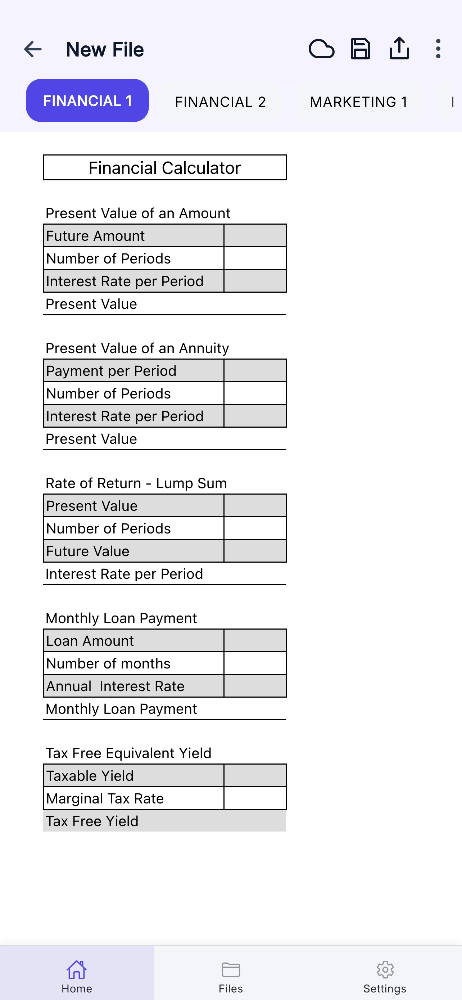
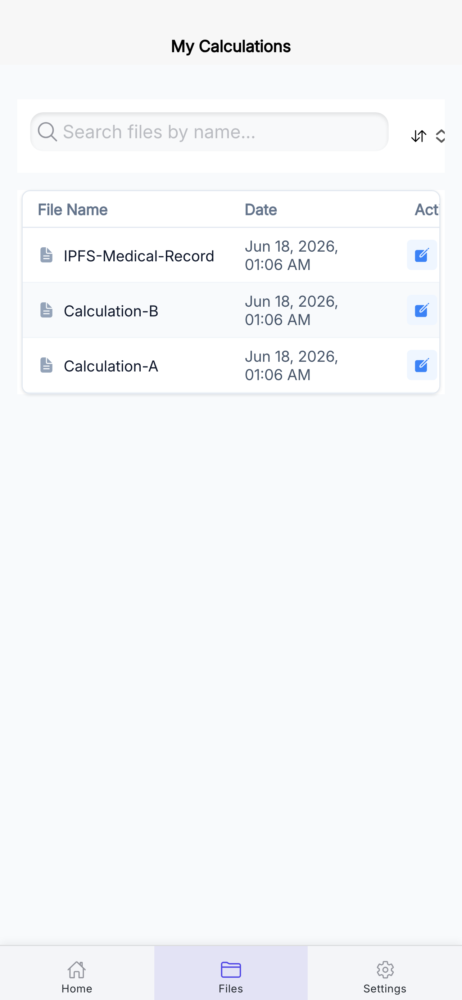
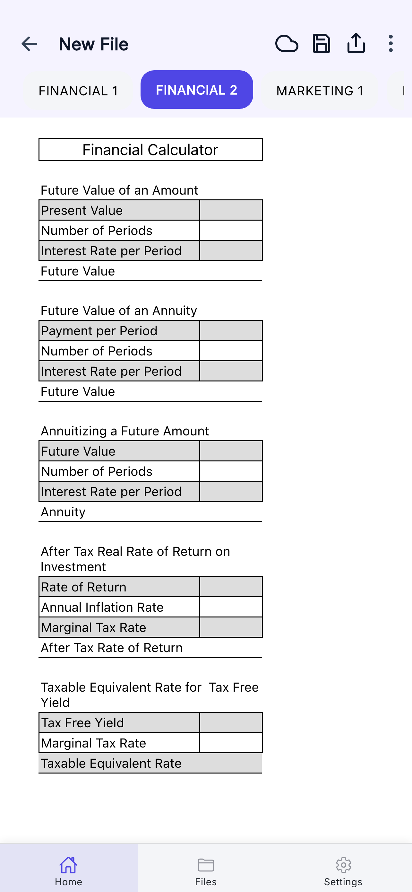
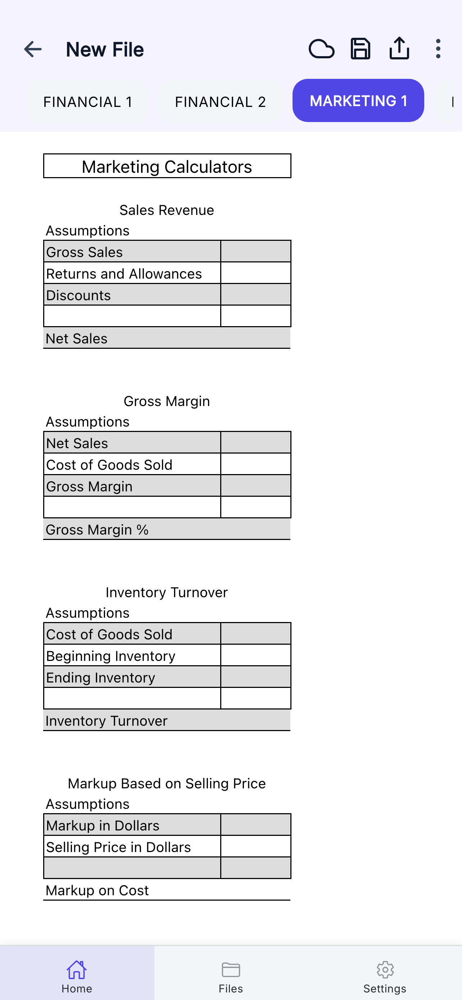
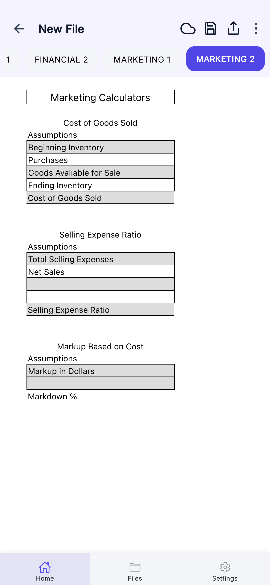
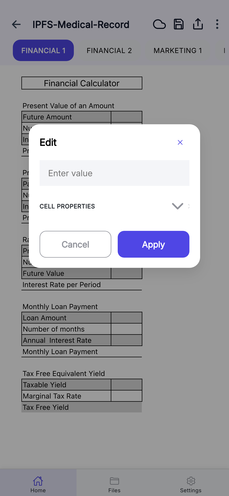
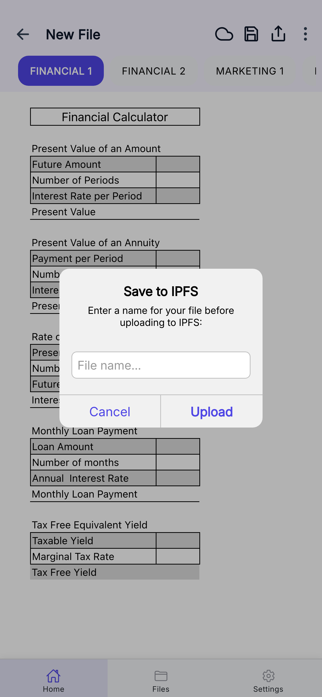
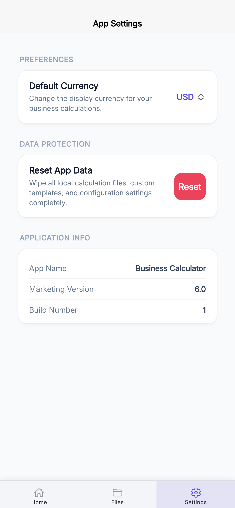

# 📱 Business Calculator

A premium, offline-first financial and marketing calculation application built with the **Ionic Framework (React)** and **Capacitor**. The core computation engine uses a mobile-optimized adaptation of **SocialCalc** to deliver spreadsheet-grade calculation logic on touch screens.

Compute present value, monthly loan payments, gross margins, inventory turnover, markups, and markdowns instantly and securely.

---

## 🎨 Application Screenshots

### 🚀 Onboarding & Dashboard
| Welcome & Onboarding | Active Calculations Dashboard | Saved Files List |
| :---: | :---: | :---: |
|  |  |  |

### 📈 Calculators & Tools
| Financial Calculations (Tab 2) | Marketing Calculations (Tab 1) | Marketing Calculations (Tab 2) |
| :---: | :---: | :---: |
|  |  |  |

### ⚡ Features & Settings
| Touch-optimized Input Overlay | Decentrialized IPFS Cloud Save | Default Preferences |
| :---: | :---: | :---: |
|  |  |  |

---

## ✨ Key Features

- **100% Offline-First Storage**: Powered by `@capacitor-community/sqlite` for local, fast structured storage. All files, custom spreadsheets, and metadata reside entirely on the local device.
- **Legacy SocialCalc Engine**: Legacy spreadsheet calculation engine wrapped and enhanced with modern custom cell-input overlays designed for mobile and tablet keyboards.
- **Decentralized Cloud Backups**: Built-in IPFS integration allowing users to export, share, and backup their sheets securely using cryptographic Content Identifiers (CIDs).
- **Financial Module**:
  - Present Value & Future Value of an Amount/Annuity
  - Rate of Return (Lump Sum)
  - Monthly Loan Payments (PMT)
  - After-Tax Real Rate of Return
  - Taxable/Tax-Free Equivalent Yields
- **Marketing Module**:
  - Sales Revenue (Gross/Net sales, returns, discounts)
  - Gross Margin & Gross Margin Percentage
  - Cost of Goods Sold (COGS)
  - Inventory Turnover Analytics
  - Markups (based on selling price or cost) and Markdown percentages
- **Local Settings**: Choose preferred global default currency (INR, USD, EUR, GBP, JPY, AUD, CAD) and manage data cleanup directly.

---

## 🛠️ Tech Stack & Architecture

- **Core Framework**: [Ionic React](https://ionicframework.com/docs/react) v8.7
- **UI & Logic**: React 19, TypeScript, Framer Motion
- **Native Bridge**: Capacitor v8
- **Database Layer**: SQLite (`@capacitor-community/sqlite`) as primary, `localStorage` for settings/state sync.
- **Bundler**: Vite
- **Decentralized Storage**: IPFS Gateway APIs

```
┌─────────────────────────────────────────────────────────┐
│                        UI LAYER                         │
│   (DashboardHome, SocialCalcPage, Settings, Files)      │
└───────────────────────────┬─────────────────────────────┘
                            │
                            ▼
┌─────────────────────────────────────────────────────────┐
│                  CONTEXT & STATE LAYER                  │
│       InvoiceContext (React) ──▶ LocalStorage           │
└───────────────────────────┬─────────────────────────────┘
                            │
                            ▼
┌─────────────────────────────────────────────────────────┐
│                      SERVICE LAYER                      │
│   localTemplateService ──▶ repositories/ (SQLite DAOs)  │
└───────────────────────────┬─────────────────────────────┘
                            │
                            ▼
┌─────────────────────────────────────────────────────────┐
│                    DATA ACCESS LAYER                    │
│   DatabaseService ──▶ SQLite / Migration / Templates     │
└─────────────────────────────────────────────────────────┘
```

---

## 🚀 Development & Setup

### Prerequisites
- Node.js (v18+)
- Ionic CLI (`npm install -g @ionic/cli`)

### Quick Start
1. Install dependencies:
   ```bash
   npm install
   ```
2. Start the development server locally:
   ```bash
   npm run dev
   ```
3. Run Unit Tests:
   ```bash
   npm run test.unit
   ```
4. Build Web Distribution:
   ```bash
   npm run build
   ```

### Capacitor Integration (Native Platforms)
To run on Android or iOS devices:
```bash
# Sync files to native folders
npx cap sync

# Run on iOS simulator/device
npx cap run ios

# Run on Android emulator/device
npx cap run android
```
